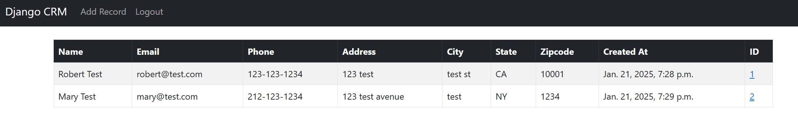

# **CRM Django Web Application**

[](https://crmdjango-e8e4052cb544.herokuapp.com/)

This is a CRM (Customer Relationship Management) web application built using Django, designed to help manage customer interactions, track sales, and streamline business operations.

🔗 **Live Demo:** [crmdjango-e8e4052cb544.herokuapp.com](https://crmdjango-e8e4052cb544.herokuapp.com/)

---

## **Features**

- 🏢 **Customer Management:** Store and manage customer information efficiently.
- 🔍 **Search and Filter:** Quickly find customer data using advanced filters.
- 🛡️ **User Authentication:** Secure login and user management.
- ⚙️ **Role-Based Access Control:** Admin and staff user roles.

---

## **Tech Stack**

- **Backend:** Django (Python)
- **Database:** PostgreSQL (via Heroku add-on)
- **Frontend:** HTML, CSS (Bootstrap)
- **Deployment:** Heroku
- **Version Control:** Git, GitHub
- **Others:** Gunicorn, Whitenoise (for static file handling)

---

## **Installation Guide**

To run this project locally, follow these steps:

### **1. Clone the Repository**
```bash
git clone https://github.com/yourusername/crm-django.git
cd crm-django
```

### **2. Create a Virtual Environment and Install Dependencies**
```bash
python -m venv venv
source venv/bin/activate  # On Windows use `venv\Scripts\activate`
pip install -r requirements.txt
```

### **3. Set Up Environment Variables**
Create a `.env` file in the root directory and add:

```
SECRET_KEY=your_secret_key
DEBUG=True
DATABASE_URL=postgres://your_local_db_url
ALLOWED_HOSTS=localhost,127.0.0.1
```

### **4. Apply Database Migrations**
```bash
python manage.py migrate
```

### **5. Run the Development Server**
```bash
python manage.py runserver
```

Visit `http://127.0.0.1:8000` in your browser.

---

## **Deployment on Heroku**

The project is deployed on Heroku. To deploy your own version:

1. **Login to Heroku:**
   ```bash
   heroku login
   ```

2. **Create a new Heroku app:**
   ```bash
   heroku create your-app-name
   ```

3. **Push code to Heroku:**
   ```bash
   git push heroku main
   ```

4. **Run database migrations on Heroku:**
   ```bash
   heroku run python manage.py migrate
   ```

5. **Open the deployed app:**
   ```bash
   heroku open
   ```

---

## **Environment Variables Used**

- `SECRET_KEY` - Django's secret key for production
- `DEBUG` - Debug mode flag (`True/False`)
- `DATABASE_URL` - PostgreSQL database URL provided by Heroku
- `ALLOWED_HOSTS` - Allowed domains for the app

---

## **Screenshots**

### Dashboard View for Admin user



---

## **Future Improvements**

- 📅 Calendar integration for scheduling
- 📊 More detailed reporting features
- 📞 Call logging system
- 📦 Inventory tracking module

---

## **Contributing**

Contributions are welcome! Follow these steps to contribute:

1. Fork the repository.
2. Create a feature branch (`git checkout -b feature-branch`).
3. Commit your changes (`git commit -m "Added new feature"`).
4. Push to the branch (`git push origin feature-branch`).
5. Open a Pull Request.

---


## **License**

This project is licensed under the [MIT License](LICENSE).

---

Let me know if you'd like to make any modifications or include additional sections!